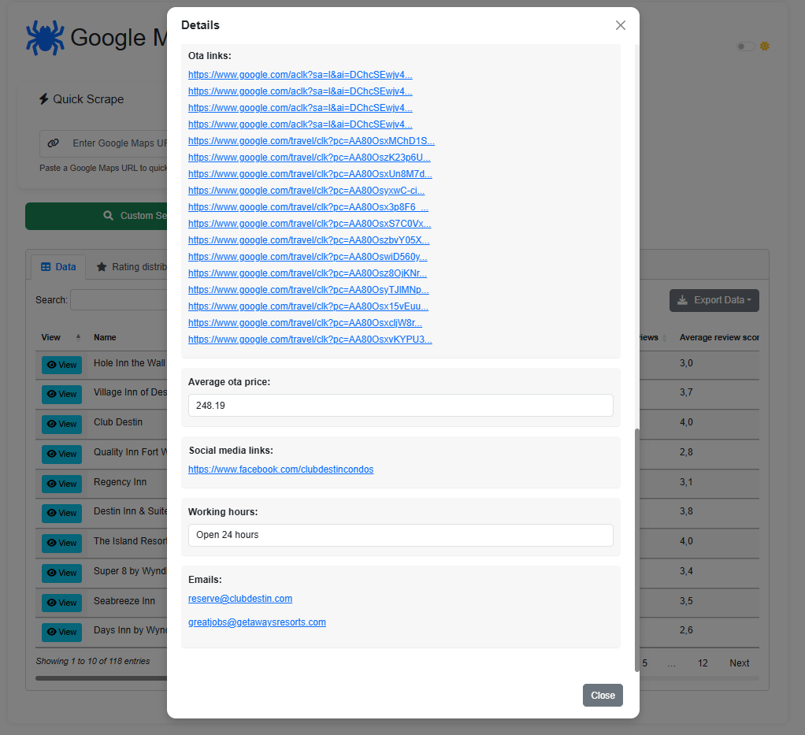

# Google Maps Scraper

A Python tool that automates the extraction of business data from Google Maps, with a focus on hotel properties. This scraper collects comprehensive information including business details, reviews, pricing, and more.

## Features

- **Automated Scrolling**: Loads multiple pages of search results for maximum coverage
- **Multi-processing**: Uses parallel processing to speed up data extraction
- **Comprehensive Data Collection**: Extracts the following data points:
  - Business name and contact details
  - Address information
  - Website URL and social media links
  - Number of reviews and average rating
  - Opening hours (including 24-hour detection)
  - Check-in/check-out times
  - Available amenities
  - Online Travel Agency (OTA) integration info
  - Average pricing from OTAs

## Requirements

- Python 3.6+
- Chrome browser
- Required Python packages (see `requirements.txt`)

## Installation

1. Clone this repository
2. Install required packages:
   ```
   pip install -r requirements.txt
   ```
3. Ensure you have Chrome browser installed

## Usage

### Basic Usage

Run the script with default parameters:

```python
python google_maps_scraper.py
```

This will search for hotels in a default location and save the results.

### Advanced Usage

You can customize the search by modifying parameters in the `perform_scraping` function:

```python
perform_scraping(
    search_query="Luxury Hotels",  # What to search for
    location=(32.3182, -86.9023),  # Latitude, longitude coordinates
    radius=5000,                   # Search radius in meters
    max_results=20                 # Maximum number of results to collect
)
```

## How It Works

1. **Initialization**: The script initializes a Chrome browser using Selenium WebDriver
2. **Search**: Opens Google Maps with the specified search query
3. **Result Collection**: 
   - Scrolls through search results to load additional businesses
   - Extracts URLs for each business listing
4. **Data Extraction**:
   - Visits each business URL individually
   - Uses a combination of Selenium and BeautifulSoup to parse page content
   - Collects detailed information about each business
5. **Data Storage**:
   - Saves raw URLs to `results/google_maps_results_urls.json`
   - Saves detailed data to `results/google_maps_results.json`
   - Exports data to CSV at `results/google_maps_results.csv`

## Key Functions

- `scrape_google_maps_urls`: Collects business listing URLs from Google Maps search results
- `scrape_url_data`: Visits individual business pages and extracts detailed information
- `perform_scraping`: Main function that coordinates the entire scraping process
- `write_to_json` and `write_to_csv`: Utility functions for data export
- `extract_number`, `clean_text`, `is_open_24_hours`: Helper functions for data cleaning

## Notes

- The script uses headless Chrome to run without a visible browser window
- Multi-processing is used to speed up data collection by processing multiple URLs in parallel
- The script includes error handling and logging for troubleshooting

## Customization

You can modify the script to collect additional data points by:

1. Adding new selectors in the `scrape_url_data` function
2. Expanding the returned data dictionary with new fields

## Logging

The script includes detailed logging to track progress and identify issues:

```python
logging.basicConfig(level=logging.INFO,
                    format="%(asctime)s - %(levelname)s - %(message)s")
```

## Legal Notice

Web scraping may be against the Terms of Service of some websites. Use this tool responsibly and ensure you have the right to access and collect the data for your intended purpose. This tool is provided for educational purposes only.

# Setup Instructions for GoogleMapsScraper

Follow the steps below to set up the project on your system.

## 1. Install Visual Studio Code
Download and install [Visual Studio Code](https://code.visualstudio.com/) for your platform:
- **Windows**: [Download for Windows](https://code.visualstudio.com/download)
- **Mac**: [Download for Mac](https://code.visualstudio.com/download)

## 2. Set Up the Environment

Open the **Terminal** and execute the following commands:

```bash
# Check if Python is installed
python -v

# Install virtualenv
pip install virtualenv

# Change directory to the desired folder
cd path/to/your/folder

# Clone the repository
git clone https://github.com/kenagt/GoogleMapsScraper

# Navigate into the project folder
cd GoogleMapsScraper

# Create a virtual environment
python -m venv .venv

# Activate the virtual environment (Windows)
.venv\Scripts\activate

# Install required dependencies
python -m pip install -r requirements.txt

python app.py
```

## 3. Running app

### Home page
Home page of flask application.


### Custom search
Custom search that allows you to enter fields like Search Query(e.g., hotels in New York), Latitude (optional e.g., 40.7128), Longitude (optional e.g., -74.0060) , Search Radius (meters), Maximum Results.


### Location based search
Select the location on map and start scraping nearby places based on field Search Query, Search Radius (meters), Maximum Results.


### Quick scrape
Paste Google Maps URL and start scraping places.


### Detail page
Detail page can be opened by clicking "View" button, and next details are shown.




